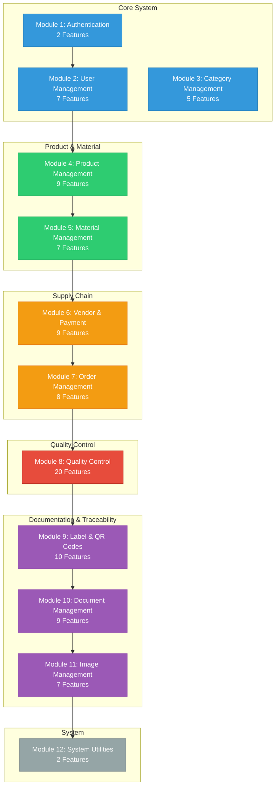

# Herbal Delight API - Module Overview Diagram

```mermaid
graph TB
    subgraph "Core System"
        AUTH[Module 1: Authentication<br/>2 Features]
        USER[Module 2: User Management<br/>7 Features]
        CAT[Module 3: Category Management<br/>5 Features]
    end
    
    subgraph "Product & Material"
        PROD[Module 4: Product Management<br/>9 Features]
        MAT[Module 5: Material Management<br/>7 Features]
    end
    
    subgraph "Supply Chain"
        VEND[Module 6: Vendor & Payment<br/>9 Features]
        ORD[Module 7: Order Management<br/>8 Features]
    end
    
    subgraph "Quality Control"
        QC[Module 8: Quality Control<br/>20 Features]
    end
    
    subgraph "Documentation & Traceability"
        LABEL[Module 9: Label & QR Codes<br/>10 Features]
        DOC[Module 10: Document Management<br/>9 Features]
        IMG[Module 11: Image Management<br/>7 Features]
    end
    
    subgraph "System"
        SYS[Module 12: System Utilities<br/>2 Features]
    end
    
    AUTH --> USER
    USER --> PROD
    PROD --> MAT
    MAT --> VEND
    VEND --> ORD
    ORD --> QC
    QC --> LABEL
    LABEL --> DOC
    DOC --> IMG
    IMG --> SYS
    
    style AUTH fill:#3498db,stroke:#2980b9,color:#fff
    style USER fill:#3498db,stroke:#2980b9,color:#fff
    style CAT fill:#3498db,stroke:#2980b9,color:#fff
    style PROD fill:#2ecc71,stroke:#27ae60,color:#fff
    style MAT fill:#2ecc71,stroke:#27ae60,color:#fff
    style VEND fill:#f39c12,stroke:#e67e22,color:#fff
    style ORD fill:#f39c12,stroke:#e67e22,color:#fff
    style QC fill:#e74c3c,stroke:#c0392b,color:#fff
    style LABEL fill:#9b59b6,stroke:#8e44ad,color:#fff
    style DOC fill:#9b59b6,stroke:#8e44ad,color:#fff
    style IMG fill:#9b59b6,stroke:#8e44ad,color:#fff
    style SYS fill:#95a5a6,stroke:#7f8c8d,color:#fff
```

